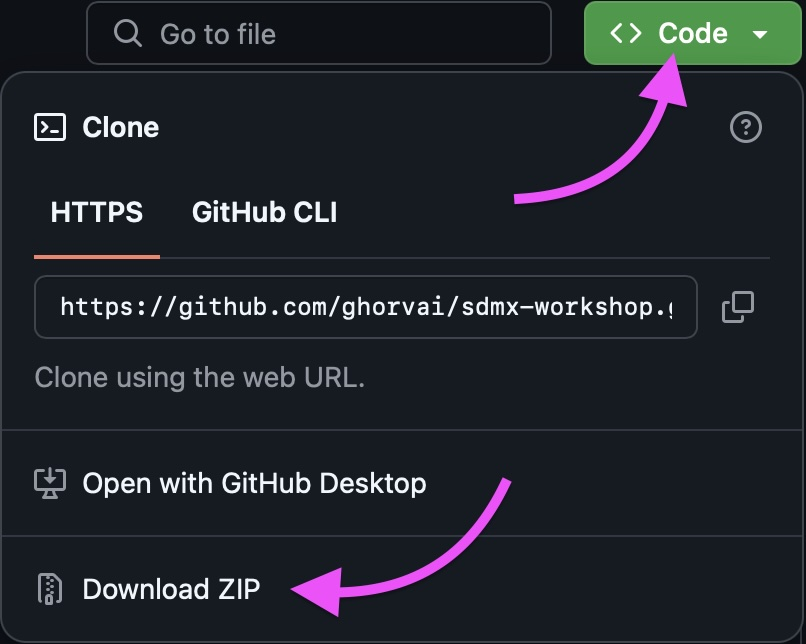
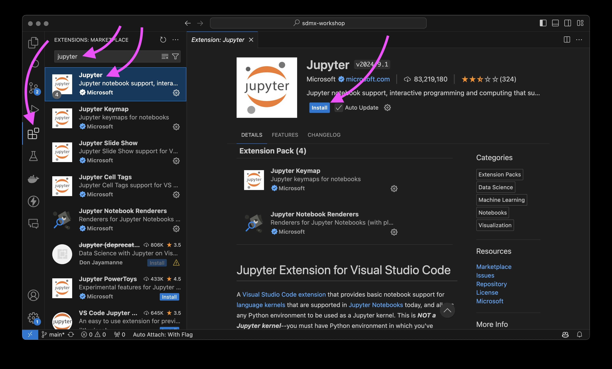
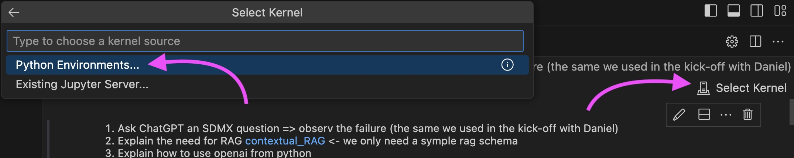

# SDMX Experts Workshop Advanced Capacity-building in Amsterdam 

## Setting Up Your Python Coding Environment
### Disclaimer
This is of course just a recommendation, we don't want anyone to feel pressured to change their trusted configuration. But if you want to replicate what you'll see in **Module 2**, here's how to do it.

**THIS TUTORIAL** is distributed in the hope that it will be useful, but **IS PROVIDED “AS IS”, WITHOUT WARRANTY OF ANY KIND, EXPRESS OR IMPLIED, INCLUDING BUT NOT LIMITED TO THE WARRANTIES OF MERCHANTABILITY, FITNESS FOR A PARTICULAR PURPOSE AND NONINFRINGEMENT. IN NO EVENT SHALL THE AUTHORS OR COPYRIGHT HOLDERS BE LIABLE FOR ANY CLAIM, DAMAGES OR OTHER LIABILITY, WHETHER IN AN ACTION OF CONTRACT, TORT OR OTHERWISE, ARISING FROM, OUT OF OR IN CONNECTION WITH THE TUTORIAL OR THE USE OR OTHER DEALINGS IN THE TUTORIAL.**

### Overview
*Recent changes in best practices for using Python have led to a shift from Anaconda to Visual Studio Code (VS Code) for Jupyter notebooks. This guide will help you set up your coding environment for a seamless experience during our workshop.*

*[Using Git with Visual Studio Code (Official Beginner Tutorial)](https://www.youtube.com/watch?v=i_23KUAEtUM&ab_channel=VisualStudioCode)*

#### *This is why we switched to VS Code:*
*1. **Better Virtual Environment Management**: VS Code offers superior virtual environment management compared to Anaconda.*
*2. **Free Access**: Anaconda is now only free for individuals and small organizations, making VS Code a more accessible option.*
*3. **Integrated Development**: VS Code integrates well with Git and other tools, providing a comprehensive development environment.*

### Steps to Set Up Your Environment

#### 1. Install Python, Git, and Visual Studio Code
- **Python**: Download and install the latest version from the [official Python website](https://www.python.org/downloads/).
- **Visual Studio Code**: Download and install VS Code from the [official VS Code website](https://code.visualstudio.com/).
- (*Optional**) **Git**: Download and install Git from the [official Git website](https://git-scm.com/downloads).

\**As an alternative to installing Git, you can download the entire repository directly from GitHub:*
- *Navigate to [https://github.com/ghorvai/sdmx-workshop](https://github.com/ghorvai/sdmx-workshop) and download the repository by clicking the green `< > Code` button and selecting `Download ZIP` from the dropdown menu:*

- *Unzip the downloaded file into a folder of your choice.*
- *Open VSCode.*
- *Open the folder by selecting **File > Open Folder...** from the menu bar.*

*You can now skip **step 3. Clone the Workshop Repository**.*

#### 2. Install the Jupyter Notebook Extension in VS Code
- Open VS Code.
- Go to the Extensions view by clicking on the Extensions icon in the Activity Bar on the left side of the window.
- Search for "Jupyter" and install the Jupyter extension.


#### 3. Clone the Workshop Repository
- Open a terminal in VS Code by selecting **View > Terminal** from the menu bar.
- Navigate to the folder where you want to download the workshop contents.
- Run the following command to clone the repository:
  ```bash
  git clone https://github.com/ghorvai/sdmx-workshop.git
  ```
- Open the folder by selecting **File > Open Folder...** from the menu bar.

#### 4. Create a Virtual Environment
- In the terminal, navigate to the cloned repository folder if you are not already there.
- Run the following command to create a virtual environment:
  ```bash
  python -m venv .venv
  ```
  This will create a virtual environment named `.venv`.

#### 5. Activate the Virtual Environment
- **Windows**:
  ```bash
  .\.venv\Scripts\activate
  ```
- **Mac/Linux**:
  ```bash
  source ./.venv/bin/activate
  ```

#### 6. Install Required Libraries
- In the terminal, ensure you're in the virtual environment by checking for the `(.venv)` prefix before the command line.
- Run the following command to install the required libraries:
  ```bash
  pip install -r requirements.txt
  ```

#### 7. Set Up Environment Variables

- Set up `.env` file in the **project root** and also in the `chat_bot` folder by copying the `.env.example` files and renaming them to `.env`.
- Fill in the `OPENAI_API_KEY` in the `.env` file in the `chat_bot` folder like so:
  ```bash
  OPENAI_API_KEY=your_open_ai_api_key_here
  ```

### Using the environment for the Jupyter notebooks

- In VSCode, go to the Explorer view by clicking on the Explorer icon in the Activity Bar on the left side of the window.
- Navigate to the `workshop_notebooks` folder and select any Jupyet notebook file with the `.ipynb` extension.
- You may need to select a kernel, if you have not already done so:
  - Click the `Select Kernel` button in the upper right corner of the notebook. In the pop-up menu, select `Python Environments...` element:
  
  - Select `★ .venv` (likely the first entry) from the list.
- You can now run the notebook cells. 🎉